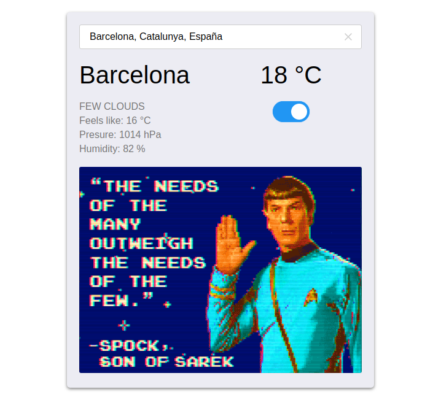

# Weather App

> An application to see cities' weather.

    

This project aims to put in practice the knowledge about asynchronous communication with promises or async/await by consuming different APIs: [OpenWeather](https://openweathermap.org/), [Giphy](https://developers.giphy.com/) and [Algolia](https://www.algolia.com/doc/rest-api/search/).

## Built With

- CSS
- HTML
- JavaScript
- [webpack](https://webpack.js.org/)

## Live Demo

[https://fivan18.github.io/weather-app/](https://fivan18.github.io/weather-app/)

## Getting Started

To get a local copy up and running follow these simple example steps.

### Prerequisites

Download the project

    $ git clone https://github.com/fivan18/weather-app.git

Install the dependencies

    $ npm install

### Usage

- Open **index.html** file with your favorite browser. It's inside the project's root directory.
- That's it. Let's start looking for cities' weather.

## Authors

👤 **Ivan Ulises Guzman Sanchez**

- Github: [@fivan18](https://github.com/fivan18)
- Twitter: [@fivanunam](https://twitter.com/fivanunam)
- Linkedin: [fivan](https://www.linkedin.com/in/fivan)

## 🤝 Contributing

Contributions, issues and feature requests are welcome!

Feel free to check the [issues page](https://github.com/fivan18/weather-app/issues).

## Show your support

Give a ⭐️ if you like this project!

## Acknowledgments

- [OpenWeather](https://openweathermap.org/)
- [Giphy](https://developers.giphy.com/)
- [Algolia](https://www.algolia.com/doc/rest-api/search/)

## 📝 License

This project is [MIT](LICENSE) licensed.
